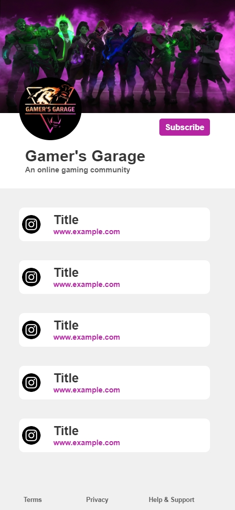
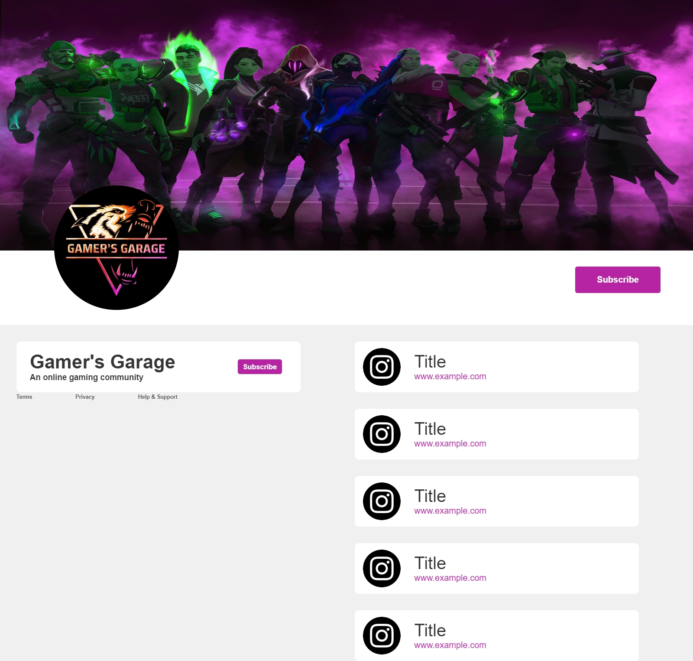

# Link Tree 

This is an open source Link Tree Component. The component itself is in its first iteration hence in a static model.

[**click here to view the component**](https://harishkumaaran.github.io/Link-Tree/)
&nbsp;

# screenshots
&nbsp;

### Mobile version

&nbsp;

### Tablet version

&nbsp;

### Desktop version

&nbsp;

&nbsp;

# Technology Stack
- HTML
- CSS
- Sass

&nbsp;

# Credits
- This Link Tree is done as a part of my Front end curriculum at Aekam Labs, Coimbatore.

